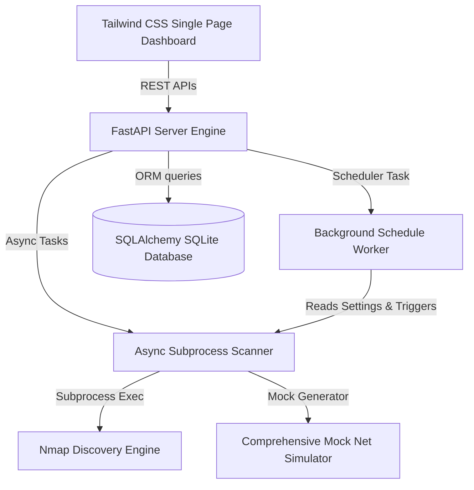

# GuardNet - Network Intelligence & Security Analysis Platform

GuardNet is a modern, enterprise-ready **Network Intelligence and Security Analysis Platform**. Beyond a simple network discovery or port scanning tool, GuardNet functions as a localized Intrusion Detection System (IDS) and asset inventory manager. It uses a FastAPI backend, SQLAlchemy ORM, and a Tailwind CSS responsive dashboard.

---

## 🛠️ Key Architectural Upgrades

1. **Structured ORM & SQLite Database**: Transitioned from raw SQL execution to **SQLAlchemy ORM**, implementing structured relational tables for `Scans`, `Devices` (Asset Inventory), `Ports` (Exposed Services), `Alerts` (Threat Log), `Vendors`, and `Settings`.
2. **Master Network Inventory Management**: Tracks the lifecycle of assets. If a device reconnects, its `last_seen` timestamp updates and its `appearance_count` is incremented.
3. **Anomalous Threat Detection Engine**: Automatically audits network changes and logs security alerts:
   - **New Device Alert**: Triggered when a new hardware address (MAC) joins the network.
   - **Hardware Change Alert**: Triggered when a device IP binds to a different MAC address.
   - **Configuration Anomaly Alert**: Triggered if a device's hostname changes.
   - **Vulnerable Service Exposure**: Flags active unencrypted protocols (FTP on port 21, Telnet on port 23, or SMB on port 445).
4. **Security Risk Scoring**: Dynamically calculates a security rating (0–100) per device based on port exposure and service configurations.
5. **Background Scan Scheduler**: Features a built-in background scheduler checking database configurations to auto-trigger standard sweeps (daily or weekly).
6. **Multi-Format Exporting**: Supports downloading intelligence data and reports in **JSON**, **CSV**, and **PDF** (rendered directly via `reportlab`).

---

## 📐 Platform Architecture



---

## ⚙️ Installation & Booting Guide

### Prerequisites
- Python 3.12+
- Nmap (Optional: Required for real sweeps; falls back to offline simulation automatically if binary is missing)

### 1. Clone & Setup Environment
Navigate to the root workspace folder:
```bash
# Create python virtual environment
python -m venv .venv

# Activate virtual environment (Windows PowerShell)
.venv\Scripts\Activate.ps1
```

### 2. Install Dependencies
```bash
pip install -r network_security_scanner/backend/requirements.txt
```

### 3. Start Platform Server
Start the Uvicorn FastAPI server:
```bash
python network_security_scanner/backend/main.py
```
*Note: A background thread will automatically launch the browser client at `http://127.0.0.1:8000/`.*

---

## 🔌 API Documentation

| Endpoint | Method | Description |
| :--- | :--- | :--- |
| `/api/network-info` | `GET` | Detects current local IP, subnet mask, and administrative privileges. |
| `/api/scan/start` | `POST` | Dispatches background scanning task (accepts profile, target, simulation toggle). |
| `/api/scan/status` | `GET` | Polls progress percentage and log streams for the active scan. |
| `/api/devices` | `GET` | Returns list of devices in inventory (supports `search`, `category`, and `risk` queries). |
| `/api/device/{id}` | `GET` | Returns comprehensive asset details, active ports, and alert histories. |
| `/api/alerts` | `GET` | Returns threat feed list (supports filtering for unresolved). |
| `/api/alerts/{id}/resolve`| `POST` | Marks an alert as resolved. |
| `/api/history` | `GET` | Returns scan cycles database list. |
| `/api/settings` | `GET` | Returns configuration options dictionary. |
| `/api/settings` | `POST` | Updates configuration keys in SQLite. |
| `/api/export/{format}` | `GET` | Downloads inventory database files in `json`, `csv`, or `pdf`. |

---

## 🧭 Roadmap & Future Extensions

- [ ] **Credentialed Audits**: Store SSH/SMB keys inside Settings to conduct authenticated software checks.
- [ ] **React & TypeScript Migration**: Migrate the vanilla frontend into a modern React framework using the existing JSON REST endpoints.
- [ ] **Vulnerability database mapping**: Query public APIs (like CVE databases) to cross-reference software product versions.
- [ ] **Telegram/Slack Webhook Integration**: Trigger instant push alerts for threat anomalies.
